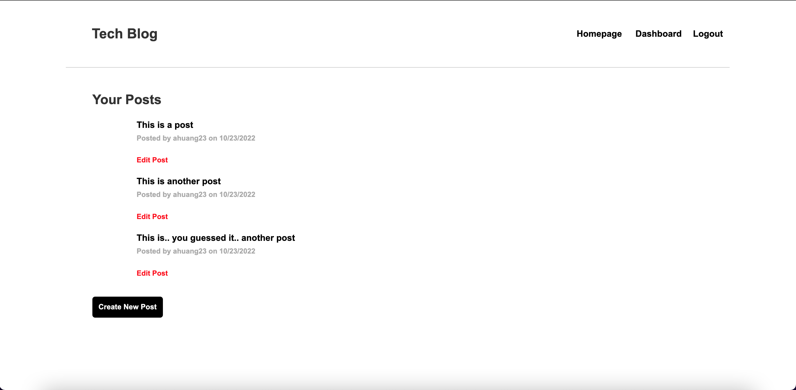

# C14_Tech_Blog

## Table-of-Contents
  * [Description](#description)
  * [Installation](#installation)
  * [Usage](#usage)
  * [Contributing](#contributing)
  * [Tests](#tests)
  * [Questions](#questions)
  * [Links](#links)
 
  ## Description
  This challenge was to create a CMS Style Blog website using the MVC paradigm for its architechural structure, Handlebars.js as the templating language, Sequelize as the ORM, adh the express-session npm package for authentication

  ## Installation
  Import the schema into your local mysql server. Run "npm i" to install all packages, and npm start to initialize your server. On your web browser, use localhost:3001.

  ## Usage
  N/A

  ## Contributing
  Currently, I am not accepting contributors for this project

  ## Tests
  N/A

  ## Questions
  For any questions, please reach out to me at the following:
  - GitHub: https://github.com/ahuang23
  - Email: a.huang232@gmail.com

  ## Example
  

  ## Links
  [GitHub](https://github.com/ahuang23/C14_Tech_Blog)
  [Heroku](https://frozen-dusk-24589.herokuapp.com/)